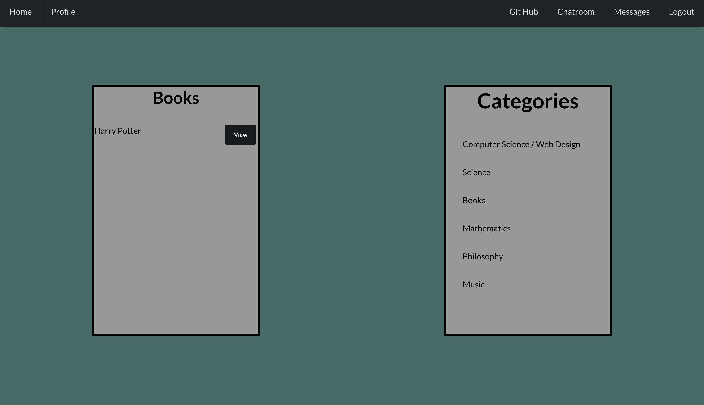
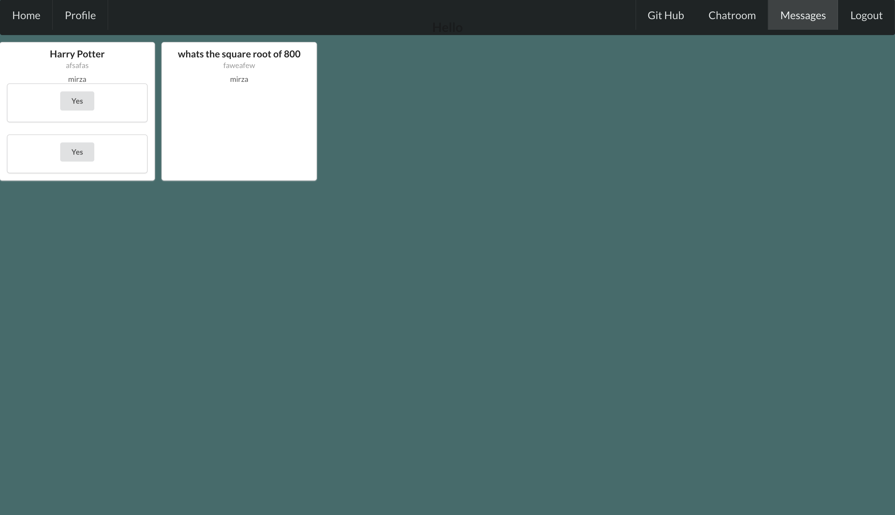
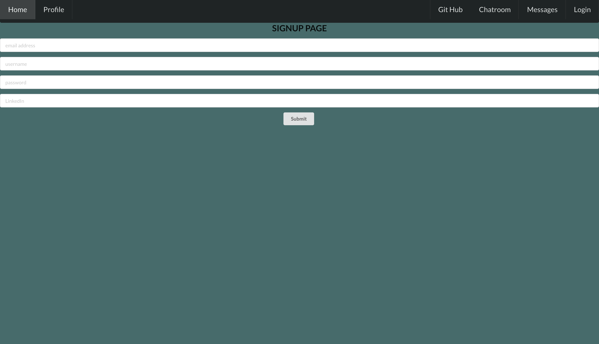
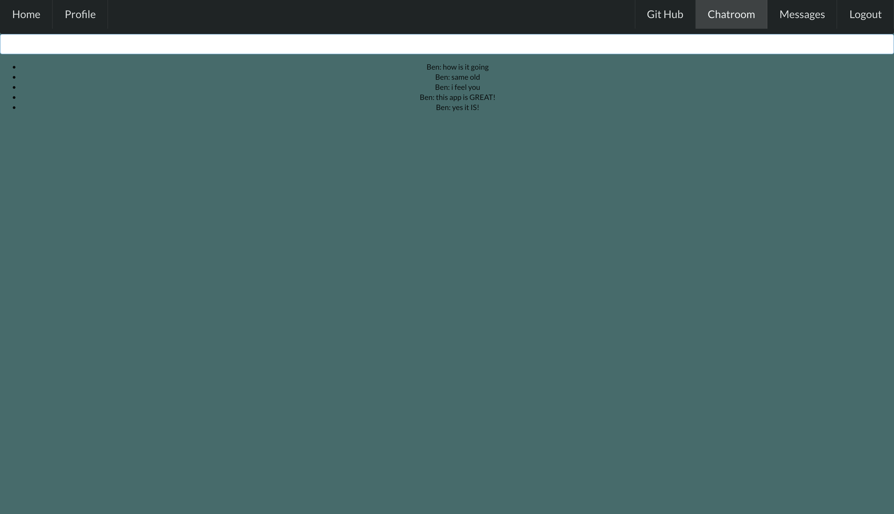

## Available Scripts
In the project directory, you can run:

## 1- npm install
## 2- nodemon

# Chat App Socket.io Backend
A User-friendly platform to locate breweries in and around Austin, TX and also give locations to nearby places to get tacos.

## Link to Site

## Languages Used
- HTML
- CSS
- JavaScript
- JSX
- Mongoose

## APIs Used:

### Front-End
- React
- Scoket.io-client

### Back-End
- Node
- Express
- Socket.io
- MongoDB

## Stretch Goals:

